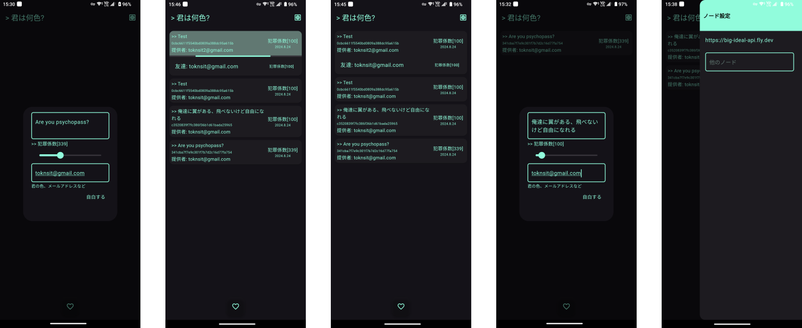

# big ideal

A app of big ideal for you my friends , written by flutter.

> 2024-08-24
>
> I choose to public it on Github before I lose my life.
>
> Because I am poor have no route in China to pass personal authentication of Google Play Console then release this app. If you are so lucky , release it to Play Store instead of me.
>
> **We can go throught the net blocking , but still lots of things too hard to do...**



> お前ら
> 
> 今で自由になれないので、明日で自由になれるか？
>
> 今すぐ自由になれ！
>
> 今で無敵になれないので、明日で無敵にならるか？
> 今すぐ無敵になれ！

## the backend

bakend is simple and it's the [repo of backend](https://github.com/toknT/big_ideal_api)

`/:md5_of_ideal`

```sh
curl -X POST -H "Content-Type: application/json" -d '{"color" : "佐藤" , "crime" : 300}' localhost:8080/md5_of_ideal
```

## inspired by

- [Attack on Titan](https://ja.wikipedia.org/wiki/%E9%80%B2%E6%92%83%E3%81%AE%E5%B7%A8%E4%BA%BA)
- [EDENS ZERO](https://ja.wikipedia.org/wiki/EDENS_ZERO)
- [PSYCHO-PASS サイコパス](https://ja.wikipedia.org/wiki/PSYCHO-PASS_%E3%82%B5%E3%82%A4%E3%82%B3%E3%83%91%E3%82%B9)
  - [犯罪係数](https://ja.wikipedia.org/wiki/PSYCHO-PASS_%E3%82%B5%E3%82%A4%E3%82%B3%E3%83%91%E3%82%B9#%E7%8A%AF%E7%BD%AA%E4%BF%82%E6%95%B0)